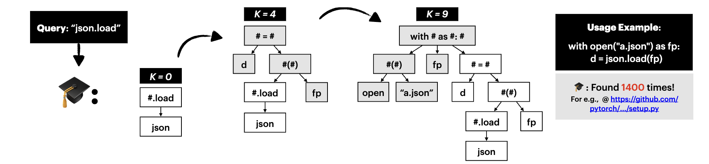

While APIs have become a pervasive component of software, a core
challenge for developers is to identify and use existing APIs. This
warrants either a deep understanding of the API landscape or access
to high-quality documentation and usage examples. While the for-
mer is infeasible, the latter is often limited in practice. 

`CodeScholar` (📝 Paper: [Under Peer-Review](-)) is a tool that generates idiomatic code examples for
query APIs (single and multiple). It finds idiomatic examples for APIS by searching a large
corpus of code and growing program graphs *idiomatically* guided by a neural model.

```bash
python search.py --dataset <dataset_name> --seed json.load
```




## Key Aspects of CodeScholar
1. 🔥 ***Fast*** neural-guided search over graphs.
2. 🧠 Idiomatic code generation by graph growing for ***representative*** examples.
3. 🪢 Single and ***Multi-API*** support, and easily extensible to new APIs.
4. 🚀 Streamlit app for ***interactive*** search.


## Table of Contents
- [How to install CodeScholar](#how-to-install-codescholar)
- [How to train CodeScholar](#how-to-train-codescholar)
- [How to run pre-trained CodeScholar](#how-to-run-pre-trained-codescholar)
- [How to run CodeScholar Streamlit App](#how-to-run-codescholar-streamlit-app)
- [Reproducability of CodeScholar Evaluation](#reproducability-of-codescholar-evaluation)


How to install CodeScholar:
-----------------------
```bash
# clone the repository
git clone git@github.com:tart-proj/codescholar.git

# cd into the codescholar directory
cd codescholar

# install basic requirements
pip install -r requirements-dev.txt

# install pytorch-geometric requirements. Use {pyg} for GPU and {torch} for CPU
pip install -r requirements-{pyg,torch}.txt

# install codescholar
pip install -e .
```


How to train CodeScholar:
-----------------------
Refer to the [training README](./codescholar/representation/README.md) for a detailed description of how to train CodeScholar.


How to run pre-trained CodeScholar:
-----------------------
    
```bash
# start an elasticsearch server (hosts programs)
docker run --rm -p 9200:9200 -p 9300:9300 -e "xpack.security.enabled=false" -e "discovery.type=single-node" docker.elastic.co/elasticsearch/elasticsearch:8.7.0
```

```bash
# start a redis server (hosts embeddings)
docker run --rm -p 6379:6379 redis
```

```bash
# index the dataset using /search/elastic_search.py
cd codescholar/search
python elastic_search.py --dataset <dataset_name>
```

> TODO: index all embeddings into redis; currently index happens before each search

```bash
# run the codescholar query (say np.mean) using /search/search.py
python search.py --dataset <dataset_name> --seed np.mean
```

You can also use some arguments with the search query:
```bash
--min_idiom_size <int> # minimum size of idioms to be saved
--max_idiom_size <int> # maximum size of idioms to be saved
--max_init_beams <int> # maximum beams to initialize search
--stop_at_equilibrium  # stop search when diversity = reusability of idioms
```
*note: see more configurations in [/search/search_config.py](./codescholar/search/search_config.py)*

How to run CodeScholar Streamlit App:
---------------------------

```bash
# cd into the apps directory
cd codescholar/apps
```

```bash
# start a redis server to act as the message broker
docker run --rm -p 6379:6379 redis
```

```bash
# start a celery backend to handle tasks asynchronously
celery -A app_decl.celery worker --pool=solo --loglevel=info
```

```bash
# start a flask server to handle http API requests
# note: runs flask on port 3003
python app_main.py
```

You can now make API requests to the flask server. For example, to run search for size `10` idioms for `pd.merge`, you can:
```bash
curl -X POST -H "Content-Type: application/json" -d '{"api": "pd.merge", "size": 10}' http://localhost:3003/search
```

```bash
# start the streamlit app on port localhost:8501
streamlit run streamlit_app.py
```

Reproducability of CodeScholar Evaluation:
---------------------------
Refer to the [evaluation README](./codescholar/evaluation/README.md) for a detailed description of how to reproduce the evaluation results reported in the paper.